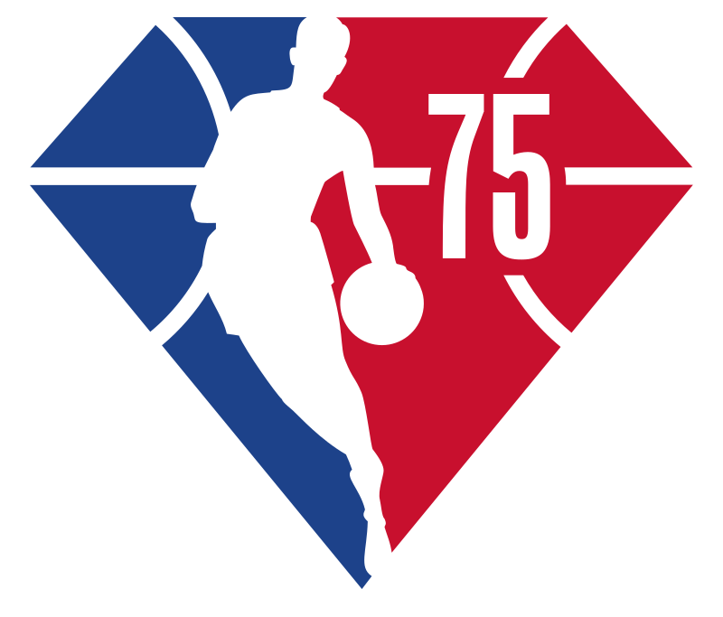

# readme

        <!-- instrução para adicionar imagem -->

<!-- 

    

-->

<!-- instrução de titulo -->

# NBA 75th ANNIVERSARY      

<!-- <h1>NBA 75 ANIVERSARY</h1> -->

Este é um paragráfo do meu README, que tem como objetivo apresentar uma documentação válida.
      <!--instrução de paragrafo -->

<!-- Este é um paragráfo do meu README, que tem como objetivo apresentar uma documentação válida. -->

<!-- instrução menu -->
Conteúdo
<ul>
    <li >
        <a href="#">Bem vindo</a>
    </li>
</ul>

<h4> :rocket: Status</h4>

<h5>... em construção</h5>

